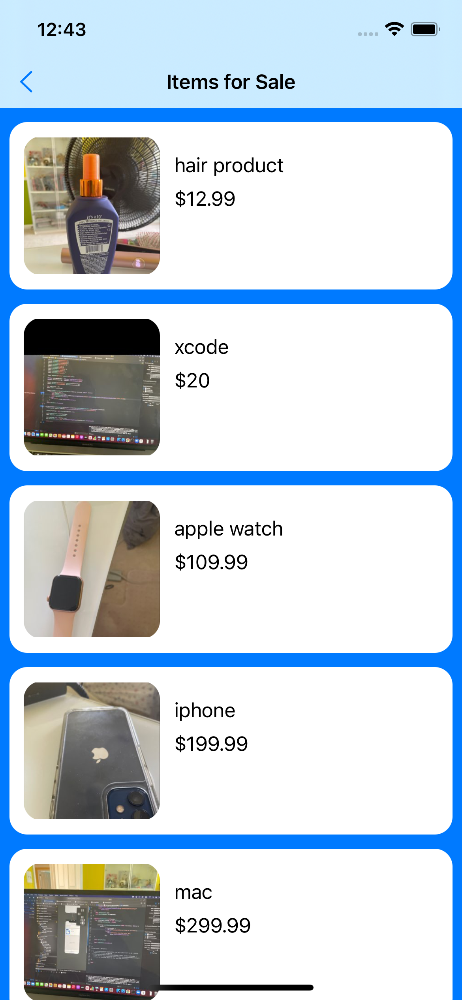
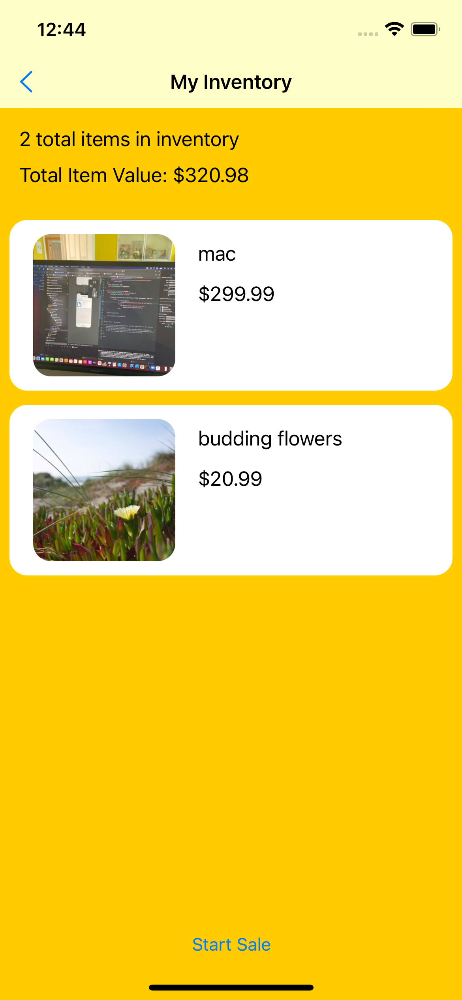
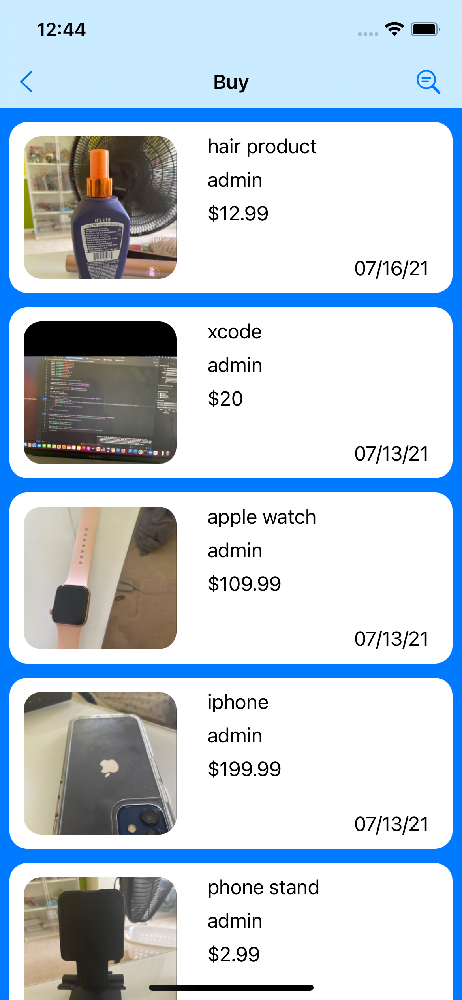
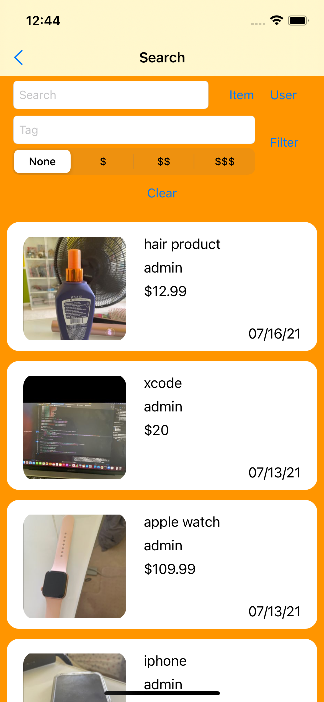
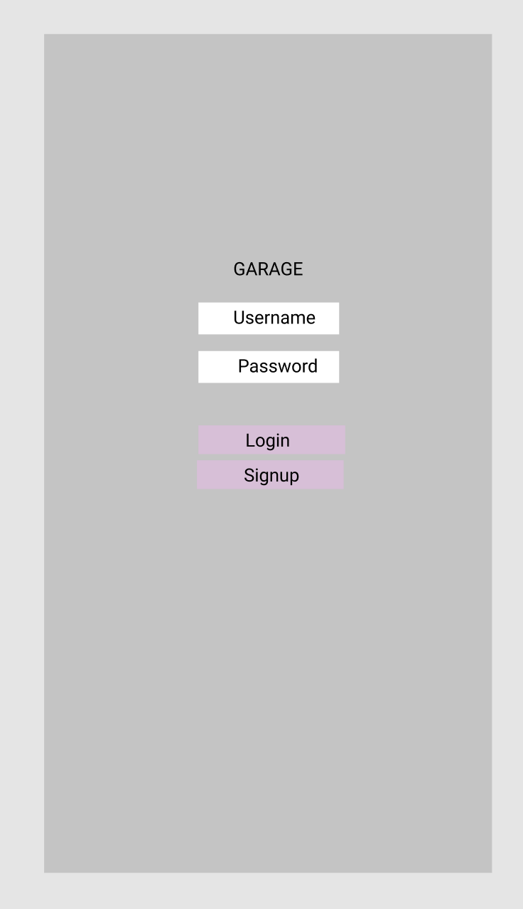

# GARAGE

## Table of Contents

1. [Overview](#Overview)
2. [Product Spec](#Product-Spec)
3. [Wireframes](#Wireframes)
4. [Schema](#Schema)

## Overview

### Description

GARAGE is an app that allows a user to decrease clutter in their house by putting items up for sale. This app allows users to maintain an inventory of items they want to sell, and gives them the option to actually sell those items as well. For a user that is looking to buy an item, there is also a browse page, in which users can filter their what they are looking for, and can then buy items that other users have put up for sale.

### App Evaluation

- **Category:**
- **Mobile:**
- **Story:**
- **Market:**
- **Habit:**
- **Scope:**

## Current Progress

Previous Features:

## Product Spec

### 1. User Stories (Required and Optional)

**Required Must-have Stories**

- [x] user login
- [x] user signup
- [x] user logout
- [x] user persistence
- [x] two tabs: "browse" and "my garage"
- [x] add item to Parse backend
    - [x] use google places api to create autocomplete address text field
- [x] start sale
- [x] view current inventory
- [x] view current items for sale
- [x] refresh controls in current inventory
- [x] refresh controls in current items for sale
- [x] browse all available items to buy
- [x] popup listing detail page 
    - [x] double tap on address to show map 
    - [x] use geocode api to get latitude and longitute from address string
    - [x] put item address marker google maps sdk
    - [x] show current location on map
    - [x] blur background when popup opens
    - [x] animate popup and blur
- [x] buy button on detail page that gives the seller's email address
- [x] search available items by keyword
- [x] search users
- [x] filter browse results by tag

**Optional Nice-to-have Stories**

- [x] popup cell to show details of item
- [x] show results within certain distance radius of user
- [x] show results within certain time radius of user
- [x] loading circle
- [ ] settings page
- [x] details page in MyGarage tab with option to delete item and start sale on individual item
- [ ] rent option
- [ ] message a seller
- [ ] favorite item
- [ ] add multiple tags to an item
- [ ] browse available tags to filter by
- [ ] upload user profile picture
- [ ] user indicated preferred payment method
- [ ] add multiple images for each listing
- [x] change default radius for browsing in settings
- [ ] keep track of what user has sold and amount
- [ ] add notification to seller
- [ ] tap on seller name to view seller page
- [x] use Directions Matrix API to calculate distance from current location to address
- [x] use Directions Matrix API to calculate time from current location to address
- [ ] use Directions  API to calculate route from current location to address
- [ ] recommended content

### 2. Screen Archetypes

* [list first screen here]
  * [list associated required story here]
  * ...
* [list second screen here]
  * [list associated required story here]
  * ...

### 3. Navigation

**Tab Navigation** (Tab to Screen)

* [fill out your first tab]
* [fill out your second tab]
* [fill out your third tab]

**Flow Navigation** (Screen to Screen)

* [list first screen here]
  * [list screen navigation here]
  * ...
* [list second screen here]
  * [list screen navigation here]
  * ...

## Wireframes

Login Page:

Browse Tab:

My Garage Tab:

### [BONUS] Digital Wireframes & Mockups

### [BONUS] Interactive Prototype

## Schema 

[This section will be completed in Unit 9]

### Models

[Add table of models]

### Networking

- [Add list of network requests by screen ]
- [Create basic snippets for each Parse network request]
- [OPTIONAL: List endpoints if using existing API such as Yelp]
