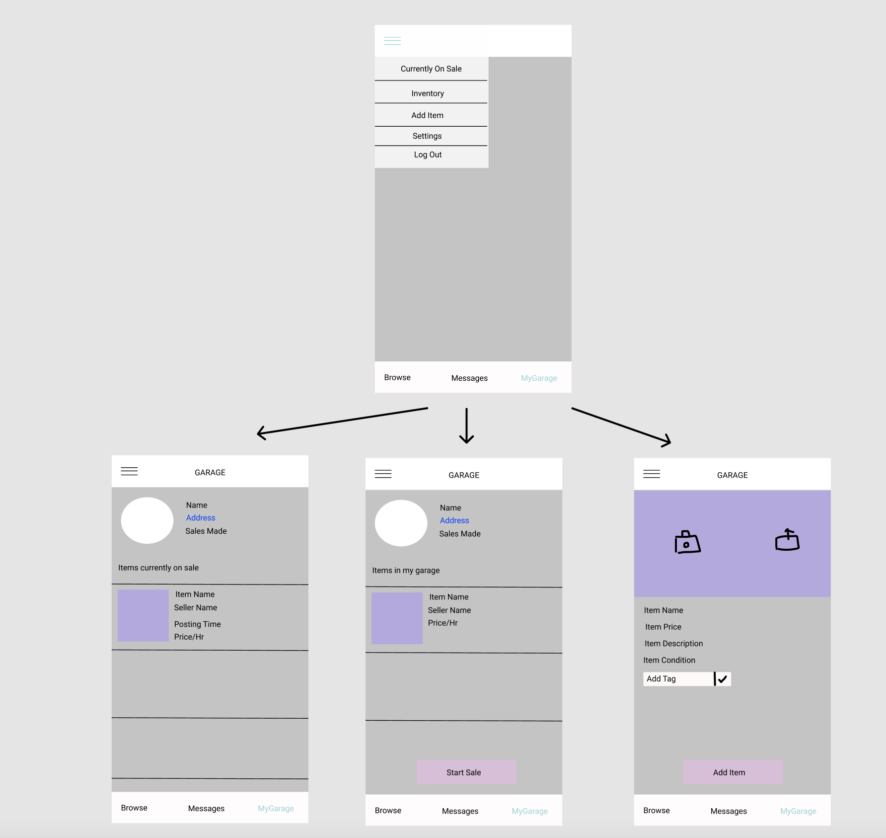

# GARAGE

## Table of Contents

1. [Overview](#Overview)
2. [Product Spec](#Product-Spec)
3. [Wireframes](#Wireframes)
4. [Schema](#Schema)

## Overview

### Description

GARAGE is an app that allows a user to decrease clutter in their house by putting items up for sale. This app allows users to maintain an inventory of items they want to sell, and gives them the option to actually sell those items as well. For a user that is looking to buy an item, there is also a browse page, in which users can filter their what they are looking for, and can then buy items that other users have put up for sale.

### App Evaluation

- **Category:**
- **Mobile:**
- **Story:**
- **Market:**
- **Habit:**
- **Scope:**

## Current Progress

## Product Spec

### 1. User Stories (Required and Optional)

**Required Must-have Stories**

- [x] user login
- [x] user signup
- [x] user logout
- [x] user persistence
- [x] two tabs: "browse" and "my garage"
- [x] add item to Parse backend
- [ ] view current inventory
- [ ] view current items for sale
- [ ] browse all available items to buy
- [ ] search avaiable items by keyword
- [ ] search users
- [ ] tap on seller name to view seller page
- [ ] filter browse results by tab
- [ ] listing detail page with google maps sdk

**Optional Nice-to-have Stories**
- [ ] rent option
- [ ] message a seller
- [ ] favorite item
- [ ] add multiple tags to an item
- [ ] browse available tags to filter by
- [ ] upload user profile picture
- [ ] add multiple images for each listing

### 2. Screen Archetypes

* [list first screen here]
  * [list associated required story here]
  * ...
* [list second screen here]
  * [list associated required story here]
  * ...

### 3. Navigation

**Tab Navigation** (Tab to Screen)

* [fill out your first tab]
* [fill out your second tab]
* [fill out your third tab]

**Flow Navigation** (Screen to Screen)

* [list first screen here]
  * [list screen navigation here]
  * ...
* [list second screen here]
  * [list screen navigation here]
  * ...

## Wireframes

[Add picture of your hand sketched wireframes in this section]

### [BONUS] Digital Wireframes & Mockups

### [BONUS] Interactive Prototype

## Schema 

[This section will be completed in Unit 9]

### Models

[Add table of models]

### Networking

- [Add list of network requests by screen ]
- [Create basic snippets for each Parse network request]
- [OPTIONAL: List endpoints if using existing API such as Yelp]
